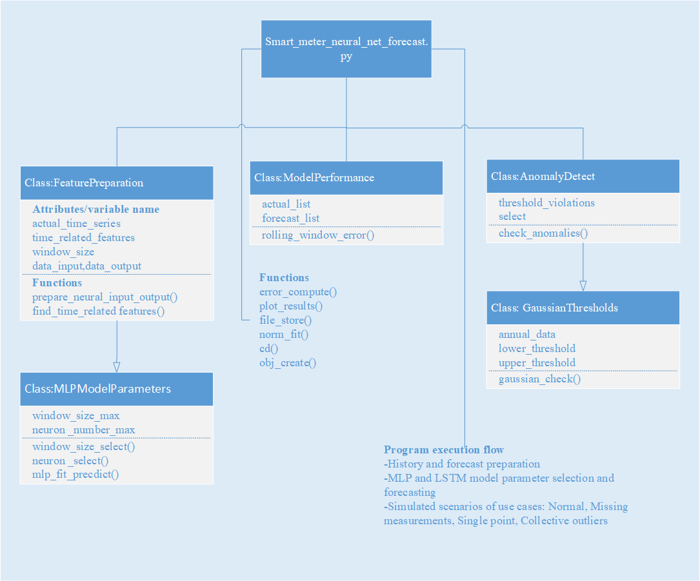

# Master thesis Chap2 programs

**Master thesis:** “Anomaly Detection in Distribution System measurements using machine learning” [Online link](http://www.dissertations.wsu.edu/Hold/A_Imayakumar_011592767.pdf)

**Advisors:** *Dr. Anjan Bose and Dr. Anamika Dubey*

This repository contains the results for the Chapter 2.  Pecan street data data-id 3967 is needed to reproduce all the plots, which is not available for public use. 
Kindly refer to Chap. 4, ref [4] on how to access this dataset. The programs associated with figures are described below.

- Local_Anomaly_detection: Fig. 2.3, 2.5 ,2.6. Accomplishes Histogram and Gaussian threshold-based detection

- MLP_LSTM_Forecast_main: Fig. 2.7 – 2.9. Performs smart meter forecasting using either MLP and LSTM Models. The classes and associated functions for this program are represented below.

- Detection_aggregated_smart_meter_data: Fig. 2.12-2.15. Builds on previous forecast program to check performance variation across dataset aggregation

